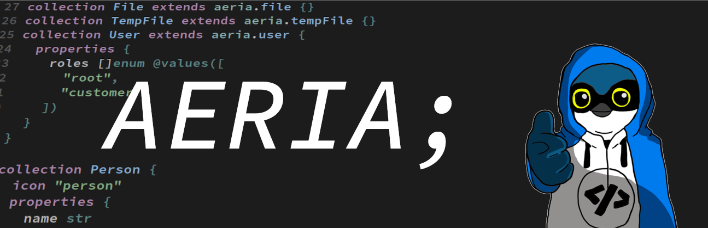
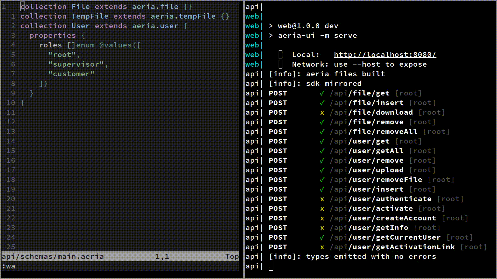

>A framework to prototype webapps fast so you can touch grass

[](https://npmjs.com/package/aeria) 

[Documentation](https://aeria.land/aeria/) |
[How to Contribute](.github/CONTRIBUTING.md)

Aeria is a framework designed to streamline CRUD-based applications with a type-safe, developer-friendly experience. It ships a thin **MongoDB** abstraction layer and a DSL that serves model definition with support for nested objects, arrays, references, upload fields, and more, making it ideal for applications with complex data structures and relational logic. On top of that a HTTP routing API with very simple bindings is provided to build business logic.

The project was created to offer a more cohesive and straightforward way to create data-centric applications using MongoDB compared to alternatives like Express/Mongoose.

### Quickstart

>$ npm create -y aeria-app hello-world

### Features

- Authentication
- File management
- Security (rate limiting, entity ownership, RBAC, etc)
- tRPC-like SDK with 1:1 typing
- Ready-to-use dashboard extensible with [Vue](https://github.com/vuejs/core)

### Demo



### Frequently Asked Questions

#### Is Aeria a programming language?

Some common concern people have when being presented to something like Aeria is: "Am I going to learn a whole new language just to use that thing?".
Aeria has a very flat learning curve because it is not a fully-fledged programming language. It has only two main concepts: **collections** and **contracts**. Learning the whole thing can be done in half an hour or even less.

You probably won't have a hard time guessing what the code below does:

```aeria
collection Person {
  icon "person"
  properties {
    name str
    job enum @values([
      "programmer",
      "doctor",
      "policeman",
    ])
    age int @minimum(1) @maximum(120)
    profile_picture File @accept(["image/*"])
  }
  functions {
    get
    getAll
    insert
    remove
    upload
  }
}
```

Or that one:

```aeria
contract GetPersonBySlug {
  payload {
    properties {
      slug str
    }
  }
  response
    | Error {
      properties {
        httpStatus int
        code str
      }
    }
    | Result Person
}
```

#### Why should I consider using it?

Aeria brings a lot of benefits when you need to prototype a MVP fast and then scale to a more robust project. The most obvious one being, the amount of code (and thus time) needed to bring up a feature is dramatically smaller compared to conventional approaches, thanks to the DSL and builtins that the framework offers.

Along with that, it ships a ready-to-use extensible dashboard and a 1:1 typed SDK. It is also [a lot faster than Mongoose and Prisma when dealing with references](https://github.com/aeria-org/benchmark).

To sum it up: if your database pick is MongoDB and you are going for building a project fast and you care about type-safety, Aeria is the right pick for you.

### Community

Reach out to learn more about Aeria and know about upcoming features.

[](https://discord.aeria.land/)

